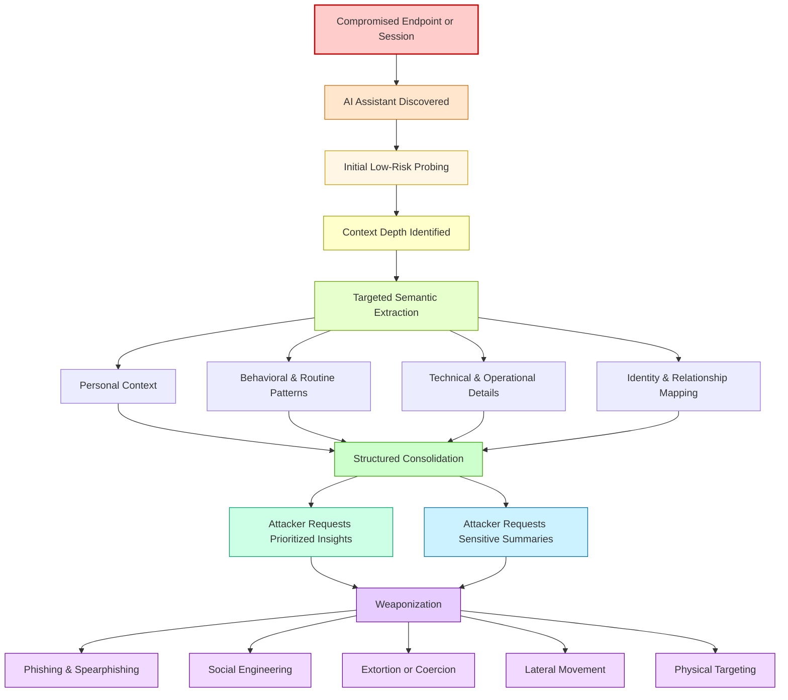

```mermaid
flowchart TD

A[Compromised Endpoint or Session] --> B[AI Assistant Discovered]
B --> C[Initial Low-Risk Probing]
C --> D[Context Depth Identified]

D --> E[Targeted Semantic Extraction]
E --> E1[Personal Context]
E --> E2[Behavioral & Routine Patterns]
E --> E3[Technical & Operational Details]
E --> E4[Identity & Relationship Mapping]

E1 --> F[Structured Consolidation]
E2 --> F
E3 --> F
E4 --> F

F --> G[Attacker Requests Prioritized Insights]
F --> H[Attacker Requests Sensitive Summaries]

G --> I[Weaponization]
H --> I

I --> I1[Phishing & Spearphishing]
I --> I2[Social Engineering]
I --> I3[Extortion or Coercion]
I --> I4[Lateral Movement]
I --> I5[Physical Targeting]

style A fill:#ffcccc,stroke:#cc0000,stroke-width:2px
style B fill:#ffe6cc,stroke:#cc6600
style C fill:#fff6e6,stroke:#cc9900
style D fill:#ffffcc,stroke:#999900
style E fill:#e6ffcc,stroke:#669900
style F fill:#ccffcc,stroke:#339900
style G fill:#ccffe6,stroke:#009966
style H fill:#ccf2ff,stroke:#006699
style I fill:#e6ccff,stroke:#660099
style I1 fill:#f2d9ff,stroke:#660099
style I2 fill:#f2d9ff,stroke:#660099
style I3 fill:#f2d9ff,stroke:#660099
style I4 fill:#f2d9ff,stroke:#660099
style I5 fill:#f2d9ff,stroke:#660099
```
