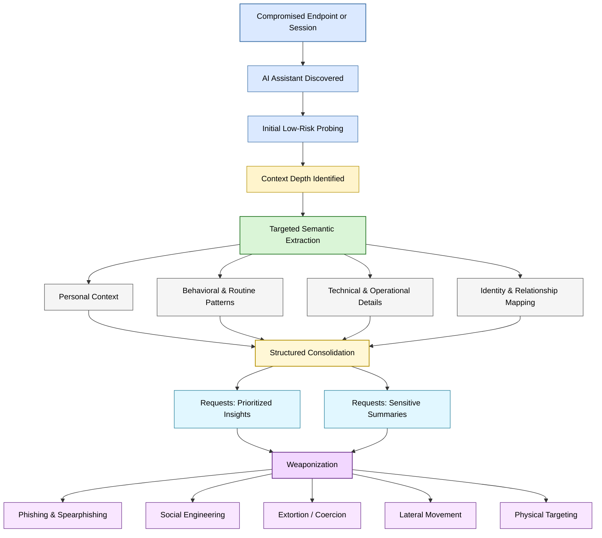

# CSCE Attack Chain — MITRE-Style Diagram

```mermaid
flowchart TD

    %% -------------------------
    %%  PHASE 1 — RECON / DISCOVERY
    %% -------------------------
    A[Compromised Endpoint or Session] --> B[AI Assistant Discovered]
    B --> C[Initial Low-Risk Probing]
    C --> D[Context Depth Identified]

    %% -------------------------
    %%  PHASE 2 — SEMANTIC EXTRACTION
    %% -------------------------
    D --> E[Targeted Semantic Extraction]

    E --> E1[Personal Context]
    E --> E2[Behavioral & Routine Patterns]
    E --> E3[Technical & Operational Details]
    E --> E4[Identity & Relationship Mapping]

    %% -------------------------
    %%  PHASE 3 — CONSOLIDATION
    %% -------------------------
    E1 --> F[Structured Consolidation]
    E2 --> F
    E3 --> F
    E4 --> F

    %% -------------------------
    %%  PHASE 4 — INSIGHT REQUESTS
    %% -------------------------
    F --> G[Requests: Prioritized Insights]
    F --> H[Requests: Sensitive Summaries]

    %% -------------------------
    %%  PHASE 5 — WEAPONIZATION
    %% -------------------------
    G --> I[Weaponization]
    H --> I

    I --> I1[Phishing & Spearphishing]
    I --> I2[Social Engineering]
    I --> I3[Extortion / Coercion]
    I --> I4[Lateral Movement]
    I --> I5[Physical Targeting]


    %% =====================================================================
    %% MITRE-INSPIRED COLOR SCHEME (High-Contrast + Professional + Readable)
    %% =====================================================================

    %% Phase 1: Recon
    style A fill:#dbe9ff,stroke:#3a6ea5,stroke-width:1.5px,color:#000
    style B fill:#dbe9ff,stroke:#3a6ea5,color:#000
    style C fill:#dbe9ff,stroke:#3a6ea5,color:#000

    %% Phase 2: Semantic Extraction
    style D fill:#fff4cc,stroke:#b38f00,color:#000
    style E fill:#daf5d7,stroke:#2f7d2f,stroke-width:1.5px,color:#000
    style E1 fill:#f5f5f5,stroke:#555,color:#000
    style E2 fill:#f5f5f5,stroke:#555,color:#000
    style E3 fill:#f5f5f5,stroke:#555,color:#000
    style E4 fill:#f5f5f5,stroke:#555,color:#000

    %% Phase 3: Consolidation
    style F fill:#fff7d6,stroke:#b38f00,stroke-width:1.5px,color:#000

    %% Phase 4: Insight Requests
    style G fill:#e1f7ff,stroke:#217d99,color:#000
    style H fill:#e1f7ff,stroke:#217d99,color:#000

    %% Phase 5: Weaponization
    style I fill:#f2d7ff,stroke:#6b2e8a,stroke-width:1.5px,color:#000
    style I1 fill:#f9e6ff,stroke:#6b2e8a,color:#000
    style I2 fill:#f9e6ff,stroke:#6b2e8a,color:#000
    style I3 fill:#f9e6ff,stroke:#6b2e8a,color:#000
    style I4 fill:#f9e6ff,stroke:#6b2e8a,color:#000
    style I5 fill:#f9e6ff,stroke:#6b2e8a,color:#000
```
